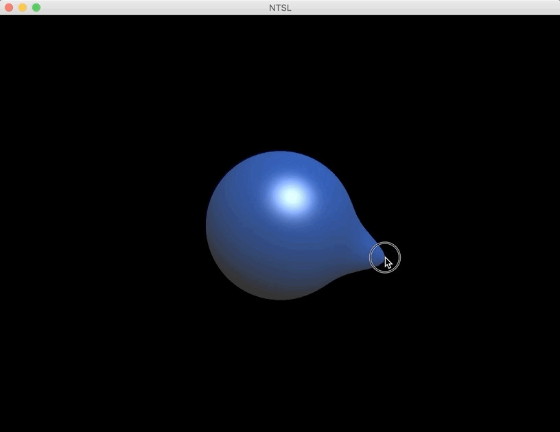

# Implementation of **Non-linear sphere tracing for rendering deformed signed distance fields**

This is an implementation of paper [None-linear sphere tracing for rendering deformed signed distance fields](https://doi.org/10.1145/3355089.3356502).

Instead of creating polygon mesh that consists of vertices, the surface is defined by implicit function (signed distance function).  
The surface which is deformed in real time is rendered using **Non-linear sphere tracing**, a method that was presented by this paper.

**NOTE**  
- This code is not reviewed nor confirmed. There could be faults in implementation, and it has some skipped parts.
- Engine/ codes are from skeleton of 2019 Spring KAIST CS380, written by KAIST CGV Lab.